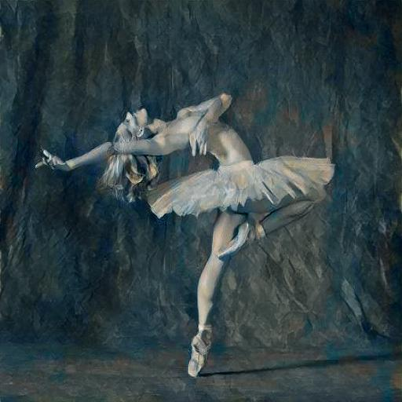
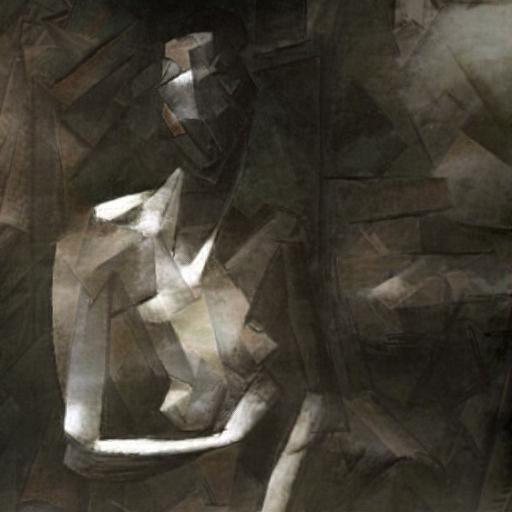
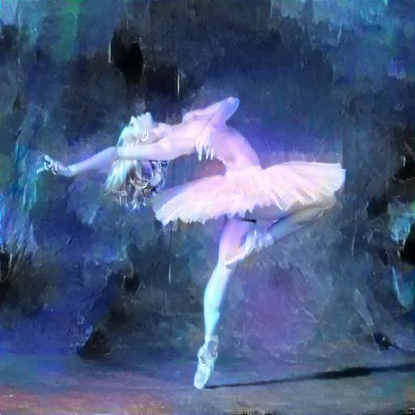
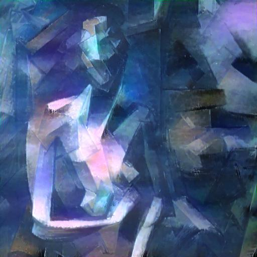
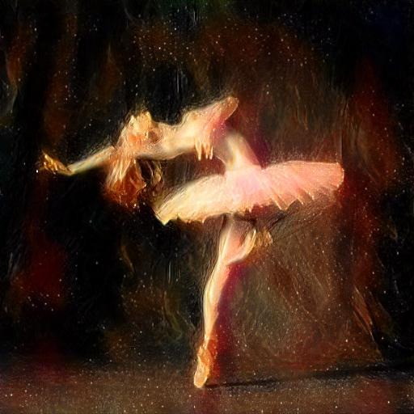
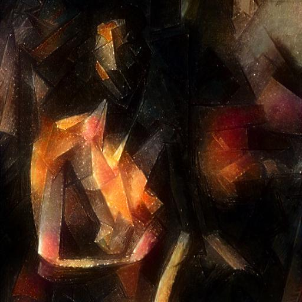

# Image Style Transfer Using Convolutional Neural Network

A pytorch implementation of neural style transfer, modified from pytorch tutorial [1].

## Requirements

- python3
- pytorch
- torchvision
- numpy
- Pillow

## Run example

```shell
python main.py --content_name picasso.jpg --style_name dancing.jpg
```

- Image used should be placed in the `image/` directory.

## Results

|                               | Dancing                | Picasso                |
| ----------------------------- | ---------------------- | ---------------------- |
| Content Image                 |  |  |
| Reverse Transfer              |       |       |
| Transfer Using `name.jpg`     |       |       |
| Transfer Using `universe.jpg` |       |       |

## Reference

[1] [pytorch neural transfer tutorial](https://pytorch.org/tutorials/advanced/neural_style_tutorial.html) and [github code](https://github.com/pytorch/tutorials/blob/master/advanced_source/neural_style_tutorial.py>)

[2] [Image style transfer using convolutional neural networks](http://openaccess.thecvf.com/content_cvpr_2016/papers/Gatys_Image_Style_Transfer_CVPR_2016_paper.pdf) by Gatys, Leon A., Alexander S. Ecker, and Matthias Bethge. CVPR, 2016.